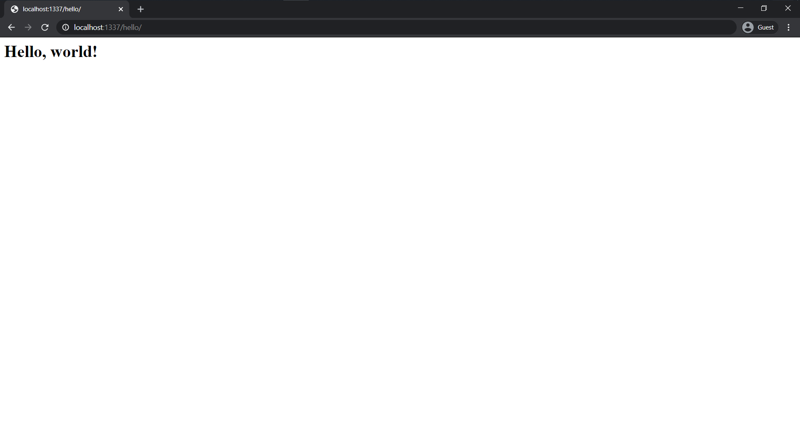

# 🚀Features
- Django 3.1 & Python 3.8
- Docker
- Gunicorn with Nginx



### 📖 Instalation 

To start, clone the repo to your local computer and change into the proper directory.
```
$ git clone https://github.com/Anonymouse228/shop.git
$ cd shop
```
**Pip**</br>
Installing virtual environment and requirements, then starting the site
```
$ python3 -m venv env
$ source env/bin/activate
(env) $ pip install -r requirements.txt
(env) $ python manage.py migrate
(env) $ python manage.py runserver
# Load the site at http://127.0.0.1:8000
```
**Docker**</br>
To launch develop version you need to do next things:
```
$ docker-compose build
$ docker-compose up -d
$ docker-compose exec web python manage.py migrate
# Load the site at http://127.0.0.1:8000
```
If you want to launch production version:
```
$ docker-compose -f docker-compose.prod.yml build
$ docker-compose -f docker-compose.prod.yml up -d
$ docker-compose -f docker-compose.prod.yml exec web python manage.py migrate
# Load the site at http://127.0.0.1:1337
```
